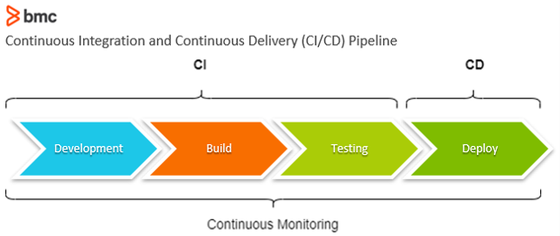

# CI/CD Documentation

## Introduction

Continuous Integration and Continuous Deployment (CI/CD) is a software development approach that aims to automate the process of building, testing, and deploying applications. This documentation provides an overview of CI/CD and outlines the steps involved in implementing a CI/CD pipeline.

## Table of Contents

1. [What is CI/CD?](#what-is-cicd)
2. [Why Jenkins?](#why-jenkins)
3. [Other Tools for CI/CD](#other-tools-for-cicd)
4. [Benefits of Building a CI/CD Pipeline](#benefits-of-building-a-cicd-pipeline)
5. [Business Value of CI/CD](#business-value-of-cicd)

## What is CI/CD?

CI/CD, which stands for Continuous Integration and Continuous Deployment, is a software development practice that focuses on automating the processes of building, testing, and deploying applications. It involves integrating code changes frequently and automatically testing and deploying them to production environments, resulting in faster and more reliable software delivery.


```python
Plan;  
Design;  
Develop;   
Test;  
Deploy.
```


## Why Jenkins?

Jenkins is a popular open-source automation server widely used for CI/CD pipelines. It offers a robust set of features and extensive plugin support, making it highly customizable and suitable for a variety of development workflows. Jenkins provides flexibility in defining pipelines, enabling developers to automate the build, test, and deployment processes seamlessly.

## Other Tools for CI/CD

While Jenkins is a widely-used tool, there are other options available for implementing CI/CD pipelines. Some notable tools include:

- CircleCI: A cloud-based CI/CD platform that offers ease of use and scalability, with a focus on simplicity and developer productivity.
- GitLab CI/CD: Built-in CI/CD solution provided by GitLab, offering tight integration with GitLab's version control and project management features.
- Travis CI: A cloud-based CI/CD platform that specializes in continuous integration for open-source projects, providing seamless integration with GitHub.

The choice of CI/CD tool depends on specific requirements, team preferences, and the ecosystem in which the development is taking place.


## Benefits of Building a CI/CD Pipeline

Building a CI/CD pipeline offers several benefits to software development teams, including:

- Automation: Automating the build, test, and deployment processes reduces manual effort, minimizes errors, and increases efficiency.
- Faster Feedback: Immediate feedback from automated tests allows developers to identify and address issues early, leading to higher code quality.
- Continuous Integration: Frequent integration of code changes enables faster detection of conflicts, promoting collaboration and smoother development workflows.
- Continuous Deployment: Automating the deployment process ensures a rapid and reliable release of new features and updates.
- Risk Reduction: Comprehensive automated testing helps mitigate the risk of deploying faulty or unstable software to production environments.

## Business Value of CI/CD

CI/CD provides significant value to businesses by:

- Accelerating Time to Market: Rapid and automated software delivery enables businesses to release new features and updates more frequently, gaining a competitive advantage.
- Improving Customer Satisfaction: Faster bug fixes, improved code quality, and regular updates lead to enhanced user experiences and higher customer satisfaction.
- Increasing Developer Productivity: Automation of repetitive tasks frees up developers' time, allowing them to focus on more valuable activities, leading to increased productivity.
- Enabling Innovation: CI/CD fosters a culture of continuous improvement, experimentation, and innovation within development teams.
- Reducing Costs: Automation and early bug detection help reduce the cost of fixing issues, ensuring efficient resource utilization.

## Generating SSH Key Pair and Adding Public Key to GitHub

To generate an SSH key pair, use the following command:

```bash
ssh-keygen -t rsa -b 4096 -C "mushahid.a@outlook.com"
```
## Adding SSH Key to GitHub

   1. Log in to your GitHub account.
   2. Navigate to the "app" repository and access the settings by clicking on your profile picture.
   3. In the left sidebar, click on "Deploy keys."
   4.  Click on "New SSH key."
   5.  Provide a title for the key (e.g., "Jenkins SSH key").
   6. Copy the contents of the public key file and paste it into the "Key" field.
   7.  Click on "Add SSH key" to save the changes.